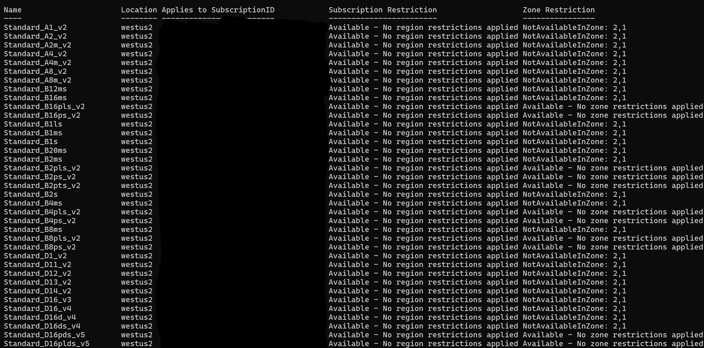

# Readme

This script will display what Azure VM sizes are currently available within a region you're interested in deploying to. 

## Usage

You can run 

`.\CheckVMAvailability.ps1 -availableonly` and it will prompt you for credentials to select the proper Azure subscription and tenant information and ask which region you're interested in.

You can also run:

`.\CheckVMAvailabilityv3.ps1 -AvailableOnly -Subscription 'SUBSCRIPTIONID GUID' -AccountId 'ACCOUNT UPN' -Tenant 'TENANTID GUID'`

which will prompt you for your password and MFA (if applicable)

## Example output

