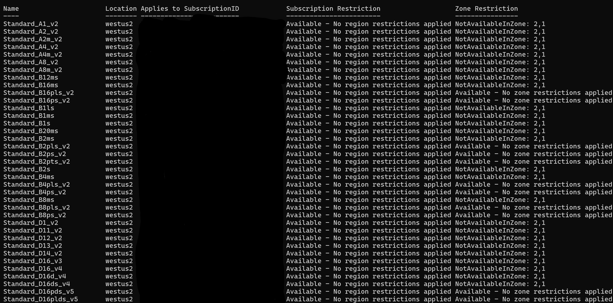

# Readme

This script will display what Azure VM sizes are currently available within a region you're interested in deploying to. 

It checks the VM SKU metadata returned by Azure for location and zone restrictions. You can also ask it to compare your requested VM count against the subscription's regional and VM-family vCPU quota.

> Azure does not expose a general-purpose API that guarantees live regional capacity for an arbitrary VM size before deployment. SKU restrictions and quota are useful preflight signals, but the deployment validation or deployment operation is still the authoritative capacity check.

## Usage

You can run 

`.\CheckVMAvailability.ps1 -Availableonly` and it will prompt you for credentials to select the proper Azure subscription and tenant information and ask which region you're interested in.

You can also run:

`.\CheckVMAvailability.ps1 -AvailableOnly -Subscription 'SUBSCRIPTIONID GUID' -AccountId 'ACCOUNT UPN' -Tenant 'TENANTID GUID'`

which will prompt you for your password and MFA (if applicable)

To investigate a specific SKU availability error, target the region and VM size directly:

`.\CheckVMAvailability.ps1 -Region westus2 -VMSize Standard_A1_v2 -CheckQuota`

Focused checks automatically use list output so long quota details are not truncated. You can also choose the output format explicitly:

`.\CheckVMAvailability.ps1 -Region westus2 -VMSize Standard_A1_v2 -CheckQuota -OutputFormat List`

For broader inventory-style output, use table format:

`.\CheckVMAvailability.ps1 -Region westus2 -AvailableOnly -OutputFormat Table`

If you are deploying multiple VMs, include the requested count so quota is calculated against the total cores required:

`.\CheckVMAvailability.ps1 -Region westus2 -VMSize Standard_A1_v2 -RequestedVMCount 3 -CheckQuota`

If your deployment pins a specific availability zone, include that zone:

`.\CheckVMAvailability.ps1 -Region westus2 -VMSize Standard_A1_v2 -Zone 1 -CheckQuota`

The capacity-related columns mean:

- `Restriction Reasons`: Azure SKU restriction reason codes returned by the Compute resource SKU API.
- `Capacity Signal`: A summarized signal from SKU restrictions and quota checks.
- `Quota Check`: Whether the subscription has enough regional and VM-family vCPU quota for the requested VM count.
- `Quota Detail`: Current quota headroom details when `-CheckQuota` is used.

If the script reports no known SKU restriction and enough quota but deployment still fails with `SkuNotAvailable` or `Capacity Restrictions`, try a different size, region, or zone, or run the actual ARM/Bicep validation for the deployment. Azure can still reject a deployment because of live capacity that is not exposed through a standalone pre-check API.

## Example output

