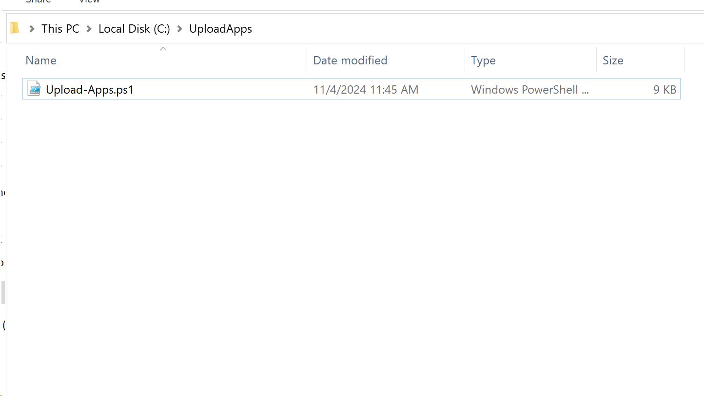
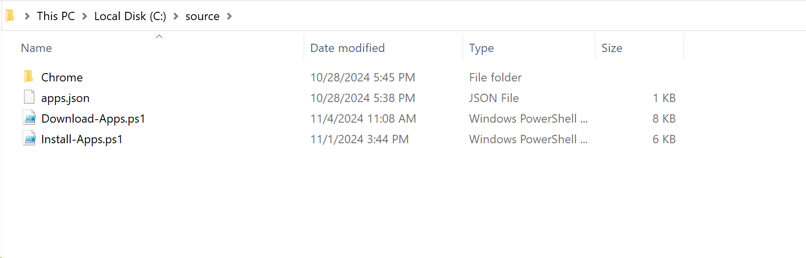
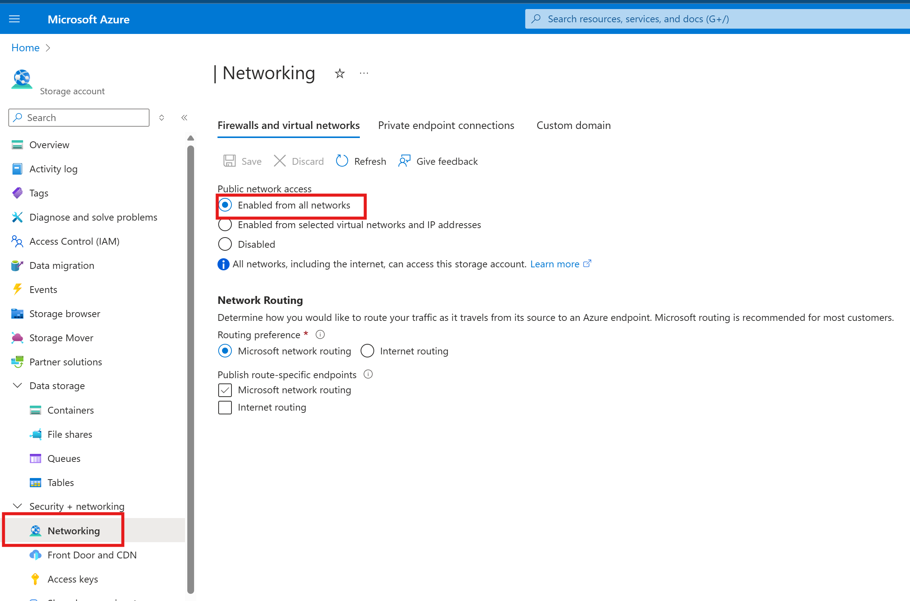
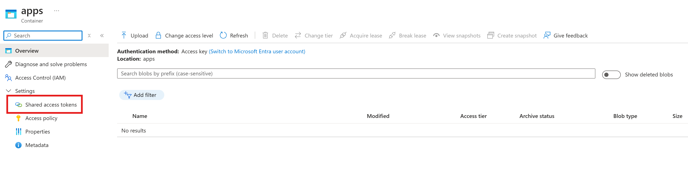
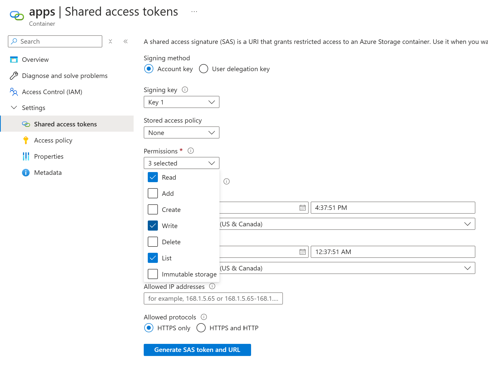
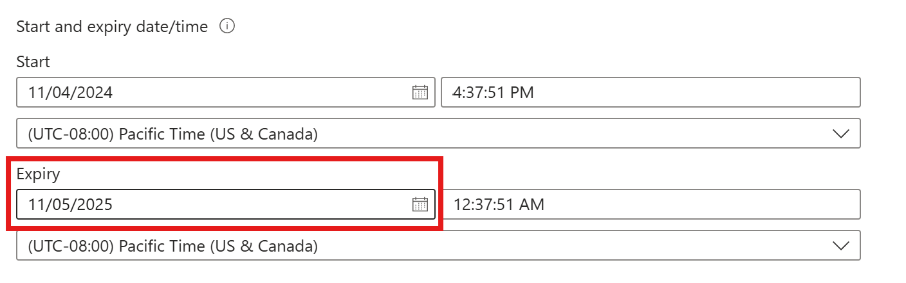
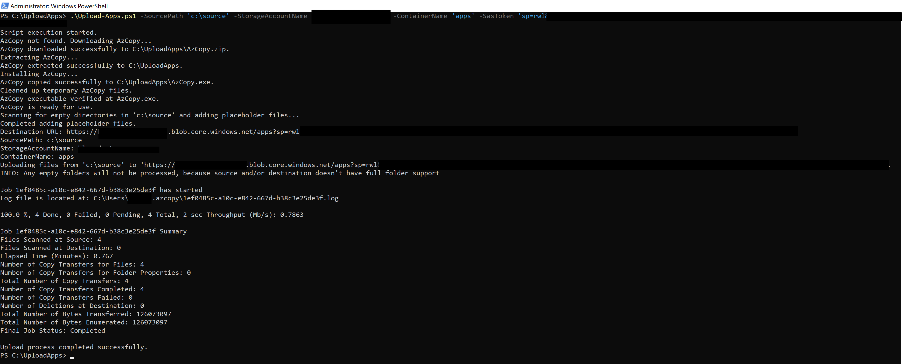
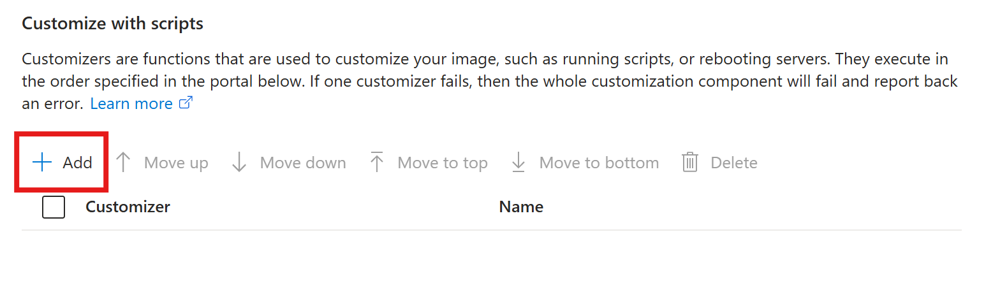

# Deploying 3rd Party Apps in Custom Images for Azure Virtual Desktop

This repository contains scripts to automate the upload, download, and installation of custom applications using Azure Blob Storage for Azure Virtual Desktop. This is designed to be used for creating custom images using Azure Image Builder with exe or msi installers.

## Scripts

There are 3 scripts leveraged in the solution.

* Upload-Apps.ps1
* Download-Apps.ps1
* Install-Apps.ps1

### Upload-Apps.ps1

Uploads the specified applications directory to Azure Blob Storage, including empty folders.

#### Description

- Checks for AzCopy in the current directory and downloads it if absent.
- Adds placeholder files to any empty directories within the specified apps directory (this is due to Azure Blob Storage not including empty folders).
- Uses AzCopy to upload the contents of the specified local apps directory to the designated Azure Blob Storage container.

#### Prerequisites

* Source folder on premises with the 3rd party application installation files that you want to install in the custom image
* Azure Storage Account
* Container name in the storage account
* SASToken on the container with Read, Write, List permissions

#### Parameters

- **SourcePath**: The path to the source files (e.g., `C:\source`).
- **StorageAccountName**: The name of your Azure Storage account.
- **ContainerName**: The name of the Blob Storage container where the apps will be uploaded.
- **SasToken**: The SAS token with Read, Write, and List permissions for the target Blob Storage container.

#### Example

```powershell
.\Upload-Apps.ps1 -SourcePath "C:\source" -StorageAccountName "mystorageaccount" -ContainerName "apps" -SasToken "your_sas_token"
```

---

### Download-Apps.ps1

Downloads applications from Azure Blob Storage to the VM that is building the custom image via Azure Image Builder

#### Description

- Downloads AzCopy if it is not already installed.
- Uses AzCopy to download the application container from Azure Blob Storage.
- Prepares the local environment for application installation by ensuring necessary directories exist.
- Logs all actions and errors to a specified log file.

#### Prerequisites

* SASToken with Read and List permissions (alternatively you can use the original token you created for upload, however that includes write permissions which aren't necessary for the VM to download the apps from the storage account)

The below parameters should be filled inside the script. Since the scripts will be in a storage account that requires using a SASToken, that token will get appended to the URL of the file (e.g. `https://your_storage_account.blob.core.windows.net/apps/Download-Apps.ps1?<your_sas_token>`). Azure Image Builder will get confused with the sas token plus the PowerShell parameters defined. So make sure to hardcode the parameter values inside the script.

#### Parameters

Hardcode these three parameters in the script

- **storageAccountName**: The name of the Azure Storage Account.
- **containerName**: The name of the Blob Storage container to download.
- **sasToken**: The SAS token with Read and List permissions for the target Blob Storage container.

Leave these at the default, or modify if desired

- **localAppsPath**: The local path where the 'apps' folder will be downloaded (Default: `C:\Temp`)
- **azCopyDownloadPath**: The local path where AzCopy will be installed (Default `C:\Temp\AzCopy`)
- **azCopyExe**: The full path to azCopy (Default `C:\Temp\Azcopy\Azcopy.exe`)
- **logFile**: The full path to the log file (Default `c:\\windows\temp\downloadapps.log`)

#### Example

If running from PowerShell command line for testing

`.\Download-Apps.ps1 -storageAccountName "mystorageaccount" -containerName "apps" -sasToken "your_sas_token"`

Hardcoding the parameters in the script for use with Azure Image Builder. Just change the Azure Blob Storage details

```powershell
param (
    # Azure Blob Storage details
    [string]$storageAccountName = 'myStorageAccount',
    [string]$containerName = 'apps',
    [string]$sasToken = 'your_sas_token',

    # Local paths
    [string]$localAppsPath = "C:\Temp",

    # AzCopy details
    [string]$azCopyDownloadUrl = "https://aka.ms/downloadazcopy-v10-windows",
    [string]$azCopyDownloadPath = "$localAppsPath\AzCopy",
    [string]$azCopyExe = "$azCopyDownloadPath\AzCopy.exe",

    # Log file path
    [string]$logFile = "C:\Windows\Temp\DownloadApps.log"
)
```

---

### Install-Apps.ps1

Installs applications silently based on a JSON configuration file.

#### Description

- Reads a JSON configuration file (`c:\temp\apps\apps.json`) that contains the application details.
- Executes the installation commands for each application.
- Logs the installation process and handles errors gracefully.

#### Parameters

- **tempPath**: The temporary path where the applications will be stored. Default is `C:\Temp`.
- **containerName**: The name of the container in the Azure Storage Account. Default is `apps`.
- **localAppsPath**: The local path where the applications will be stored (`$tempPath\$containerName`).
- **jsonConfigPath**: The path to the JSON configuration file. Default is `$localAppsPath\apps.json`.
- **logFile**: The path to the log file where execution details will be recorded.

#### Example

```powershell
.\Install-Apps.ps1
```

---

## Configuration File

### apps.json

A JSON file that lists the applications to install, along with their installer paths and installation arguments. This only supports exe and msi installers.

#### Example

```json
{
    "Applications": [
        {
            "Name": "Google Chrome",
            "InstallerPath": "C:\\Temp\\Apps\\Chrome\\googlechromestandaloneenterprise64.msi",
            "Arguments": "/qn /norestart"
        },
        {
            "Name": "Example App",
            "InstallerPath": "C:\\Temp\\Apps\\ExampleApp\\exampleinstaller.exe",
            "Arguments": "/silent /install"
        }
    ]
}
```

---

## Usage

1. Upload source content and Download-Apps.ps1, Install-Apps.ps1, and apps.json files to storage account
2. Create customization scripts in Azure Image Builder/Custom Image Template in Azure Virtual Desktop

It's assumed that you've already modified the apps.json file.

### Upload source content

1. Copy the Upload-Apps.ps1 file to some location where your application content is. This should not be in the same folder where your content is. In this example we're using c:\UploadApps\Upload-Apps.ps1

   
2. Prepare the content folder. In this example we're using a c:\source folder. In this folder copy in your applications and the apps.json, Download-Apps.ps1, and Install-Apps.ps1 files.

   
3. In your Azure storage account, check your networking configuration under **Security + networking - Networking** and make sure under Public network access **Enabled from all networks** is selected. If Enabled from selected virtual networks and IP addresses is selected, the verification process that Azure Image Builder uses to verify the customization scripts are accessible will fail, even if you add your own VNet. This is because the verification process doesn't verify access to the script from your VNet. The script would likely work fine from within the VM as it's building since it'd be connected to your VNet, but the pre verification process will fail and you won't know why (and spend hours troubleshooting something so simple :))

   
4. In your Azure storage account, create a new container if you don't have one you want to use already. In this example, we're using a container named `apps` In this container, select **Settings - Shared access tokens**

   
5. Under **Permissions** select **Read, Write, List**

   
6. Change the **Expiry** to expire a year from now (this is up to you - just remember what you set this expiration date to)

   
7. Click **Generate SAS token and URL** and copy the **Blob SAS Token**
8. Edit the **Download-Apps.ps1** file and change the `$storageAccountName`, `$containerName`, and `$sasToken` parameters
9. Open PowerShell and run `.\Upload-Apps.ps1 -SourcePath 'c:\source' -StorageAccountName 'yourstorageaccount' -ContainerName 'apps' -SasToken 'your_sas_token'`. The output should look like the following.

   

The content is now uploaded to the storage account.

### Create customization scripts in Azure Image Builder/Custom Image Templates
You don't need to do both of these, just one or the other. Custom Image Templates are part of Azure Virtual Desktop host pool creation. 

#### Azure Image Builder

1. Under the Customizations tab in the section titled **Customize with scripts** click **Add**

   
2. For **Customizer** select **Run a powershell script**

   **Name**: Download-Apps

   **Script source URL**: `https://your_storage_account.blob.core.windows.net/apps/Download-Apps.ps1?your_sas_token `
   Note: The `?your_sas_token` is just one question mark, not two. This SAS token has write permissions which aren't needed to retrieve the script. If you want to run with least priviledge, you can generate a new SAS token with Read and List permissions

   Click **OK**
3. Repeat step 1 so we can add the Install-Apps.ps1 file
4. For **Customizer** select **Run a powershell script**

   **Name**: Install-Apps

   **Script source URL**: `https://your_storage_account.blob.core.windows.net/apps/Install-Apps.ps1?your_sas_token `
   Note: The `?your_sas_token` is just one question mark, not two. This SAS token has write permissions which aren't needed to retrieve the script. If you want to run with least priviledge, you can generate a new SAS token with Read and List permissions
   
   **Permissions:** Run as Elevated

   **Run as system:** Checked

   Depending on the application(s), you may not need to run as elevated, however in most cases this is probably necessary

#### Custom Image Templates

1. Under the **Customizations** tab click **Add your own script**

   **Script Name:** Download-Apps

   **URI:** `https://your_storage_account.blob.core.windows.net/apps/Download-Apps.ps1?your_sas_token`

   Note: The `?your_sas_token` is just one question mark, not two. This SAS token has write permissions which aren't needed to retrieve the script. If you want to run with least priviledge, you can generate a new SAS token with Read and List permissions
2. Under the **Customizations** tab click **Add your own script**

   **Script Name:** Install-Apps

   **URI:** `https://your_storage_account.blob.core.windows.net/apps/Install-Apps.ps1?your_sas_token`

   Note: The `?your_sas_token` is just one question mark, not two. This SAS token has write permissions which aren't needed to retrieve the script. If you want to run with least priviledge, you can generate a new SAS token with Read and List permissions

---
